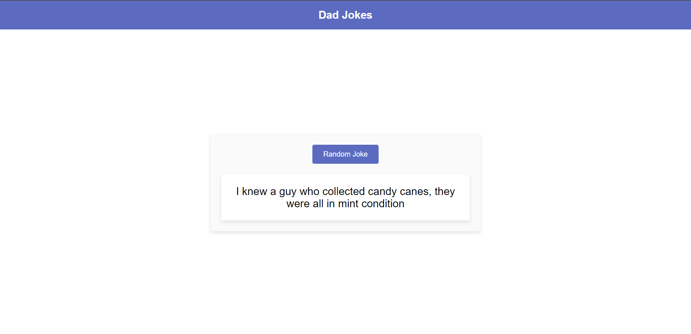

<h1 align="center">Dad Jokes</h1>

  

A basic website that displays a new Dad Joke every time the button is clicked.

## Table of Contents

- [Description](#description)
- [Usage](#usage)
- [Technologies Used](#technologies-used)
- [Contributing](#contributing)
- [Credits](#credits)
- [License](#license)

## Description

Dad Jokes is a simple website that uses HTML, CSS, and JavaScript to display a new Dad Joke every time the "New Joke" button is clicked. The website utilizes an API to fetch the jokes and display them to the user.

## Usage

To use the Dad Jokes website, follow these steps:

1. Visit the live page link above.
2. Click on the "New Joke" button to display a new Dad Joke.
3. Enjoy the humor!

## Technologies Used

The Dad Jokes website was built using the following technologies:

- HTML
- CSS
- JavaScript
- [icanhazdadjoke API](https://icanhazdadjoke.com/api)

## Contributing

If you'd like to contribute to the Dad Jokes website, feel free to fork this repository and submit a pull request.

## Credits

The Dad Jokes website was inspired by the popularity of Dad Jokes on the internet.

## License

This project is licensed under the MIT License. See the LICENSE file for details.
